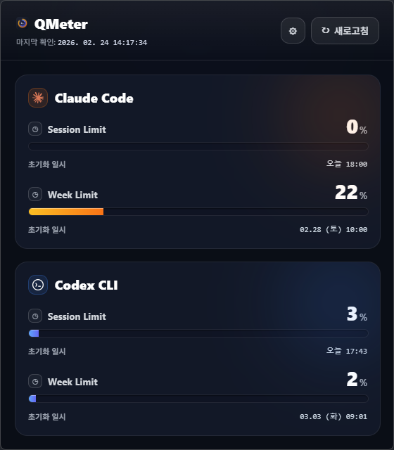

# QMeter

[English](./README.md) | 한국어

QMeter는 Claude Code/ Codex 사용량과 초기화 시간을 한눈에 확인하는 Windows 트레이 앱 + CLI입니다.



## 주요 기능

- Claude / Codex 사용량 통합 조회
- 트레이 팝업 UI (카드 기반)
- JSON 출력 CLI (`qmeter --json`)
- 캐시/부분 실패 처리
- 환경설정
  - 새로고침 주기 변경
  - 표시 카드(Claude/Codex) on/off

## 요구사항

- Node.js 20+
- Windows 11 (트레이 앱 기준)

## 설치

```bash
npm install
```

## 설치본 사용자용 CLI 빠른 시작

Windows 설치 파일(NSIS/Portable)로 설치하면 트레이 앱은 바로 사용할 수 있지만,
`qmeter` CLI 명령이 PATH에 자동 등록되지는 않습니다.

CLI를 사용하려면 Node.js 환경에서 아래 방식 중 하나를 사용하세요.

1) 빌드 후 직접 실행

```bash
npm run build
node dist/cli.js --help
node dist/cli.js --json
```

2) 전역 링크 후 `qmeter` 명령 사용

```bash
npm link
qmeter --help
qmeter --json
```

자주 쓰는 옵션

- `--json`: JSON 형식 출력
- `--refresh`: 캐시 무시 후 새로 조회
- `--debug`: 디버그 정보 출력(민감정보 제외)
- `--view table|graph`: 출력 형식 선택
- `--providers claude,codex,all`: 조회 provider 선택

## 개발/실행

### 타입체크

```bash
npm run typecheck
```

### 테스트

```bash
npm test
```

### 빌드

```bash
npm run build
```

### CLI 실행

```bash
node dist/cli.js --json
```

또는 전역 링크:

```bash
npm link
qmeter --json
```

### 트레이 앱 실행

```bash
npm run tray:start
```

### 트레이 스모크 테스트

```bash
npm run tray:smoke
```

## 환경설정

트레이 UI의 설정 버튼(톱니)에서 아래 항목을 설정할 수 있습니다.

- 새로고침 주기
- 표시할 카드(Claude/Codex)

설정은 로컬 사용자 설정 폴더에 저장됩니다.

## 리소스 파일

`resources` 폴더의 리소스를 사용합니다.

- `resources/QMeter.ico`
- `resources/QMeter.png`
- `resources/Claude.png`
- `resources/Codex.png`

빌드 시 `scripts/copy-resources.mjs`로 `dist/resources`에 자동 복사됩니다.

## 패키징(배포본)

### 디렉터리 아웃풋

```bash
npm run tray:pack:dir
```

### Windows 설치본(NSIS + Portable)

```bash
npm run tray:pack
```

산출물은 `dist` 하위가 아니라 electron-builder 기본 경로(`dist`/`release` 설정에 따름)로 생성됩니다.

## 트러블슈팅

- Codex 실행 실패(`spawn EINVAL` 등)
  - Windows 셸/경로 이슈일 수 있습니다.
  - Codex 설치/로그인 상태 확인 후 재실행하세요.
- 카드가 보이지 않음
  - 해당 provider가 설치/인증되지 않았거나, 설정에서 OFF일 수 있습니다.
