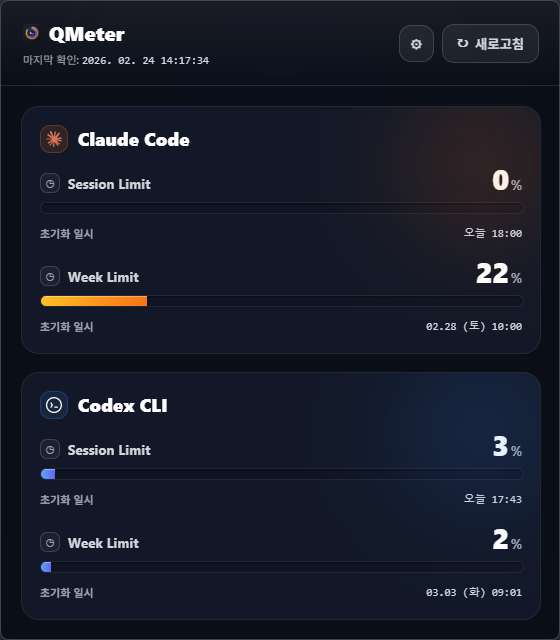

# QMeter

English | [한국어](./README.ko.md)

QMeter is a Rust-native Windows tray app and CLI for checking Claude Code and Codex usage, reset timing, cache state, and partial provider failures.

## Screenshot



## Features

- Unified Claude/Codex usage snapshot
- CLI output as table, graph, or JSON
- Windows tray icon with manual refresh and native popup
- Background refresh using persisted tray settings
- Threshold notifications with cooldown, hysteresis, and quiet hours
- Per-provider cache fallback when live collection fails

## Requirements

- Rust stable
- Windows 11 for the tray app
- Claude Code login for Claude usage
- Codex CLI ChatGPT login for Codex usage

## Build And Run

Release binaries are named `qmeter.exe` for the CLI and `qmeter-tray.exe` for the tray app.
The CLI Cargo package is also named `qmeter`, so development commands use `-p qmeter`.

```powershell
cargo test --workspace
cargo run -p qmeter -- --json
cargo run -p qmeter -- --view table
cargo run -p qmeter -- --view graph
cargo check -p qmeter-tray
cargo build -p qmeter-tray
cargo run -p qmeter-tray --bin qmeter-tray
```

Use fixture mode for deterministic local output:

```powershell
$env:USAGE_STATUS_FIXTURE='demo'
cargo run -p qmeter -- --json
cargo run -p qmeter -- --view table
cargo run -p qmeter -- --view graph
```

## CLI

Installed or release binary:

```powershell
qmeter.exe --json --providers claude,codex --refresh --debug
```

Development run from source:

```powershell
cargo run -p qmeter -- --json --providers claude,codex --refresh --debug
```

Options:

- `--json`: print normalized JSON
- `--refresh`: bypass fresh cache
- `--debug`: print provider diagnostics without secrets
- `--view table|graph`: choose terminal rendering
- `--providers claude,codex,all`: select providers

Exit codes:

- `0`: full success
- `1`: partial success
- `2`: argument or usage error
- `3`: total provider failure

## Tray

```powershell
cargo build -p qmeter-tray
cargo run -p qmeter-tray --bin qmeter-tray
```

The tray app:

- loads settings from `%APPDATA%\qmeter\tray-settings.v1.json`
- writes runtime logs to `%LOCALAPPDATA%\qmeter\tray-runtime.log`
- stores notification state at `%LOCALAPPDATA%\qmeter\notification-state.v1.json`
- supports `Open QMeter`, `Refresh`, `Settings`, and `Quit` menu actions
- owns a reusable WebView2 overlay for usage cards and manual refresh

## Provider Notes

Claude usage is collected through Claude Code OAuth credentials and Anthropic's usage endpoint. On Windows/Linux, QMeter reads `~/.claude/.credentials.json`; on macOS it tries the `Claude Code-credentials` Keychain item first.

Codex usage is collected with the ChatGPT OAuth token saved by Codex CLI at `~/.codex/auth.json`. QMeter calls the Codex usage endpoint directly, so refreshes do not spawn `codex.cmd` or `cmd.exe`.

## Release Binaries

```powershell
cargo build --release --workspace
```

Outputs:

- `target/release/qmeter.exe`
- `target/release/qmeter-tray.exe`

Tag-triggered GitHub Actions builds these binaries and uploads them to the matching GitHub release.

## CI/CD

GitHub Actions runs the Rust CI/CD path only when a new `v*` tag is pushed:

- `Release` validates the tag format
- CI checks `cargo fmt --all --check`, `cargo clippy --workspace --all-targets --locked -- -D warnings`, `cargo test --workspace --locked`, and `cargo build --release --workspace --locked`
- CD zips `qmeter.exe` and `qmeter-tray.exe`, then uploads the release assets

## Troubleshooting

- Missing Claude rows usually means Claude Code is not logged in or the OAuth credentials file is unavailable.
- Missing Codex rows usually means Codex CLI has not completed ChatGPT login or `~/.codex/auth.json` is unavailable.
- Set `USAGE_STATUS_FIXTURE=demo` to test CLI/tray rendering without touching live providers.
